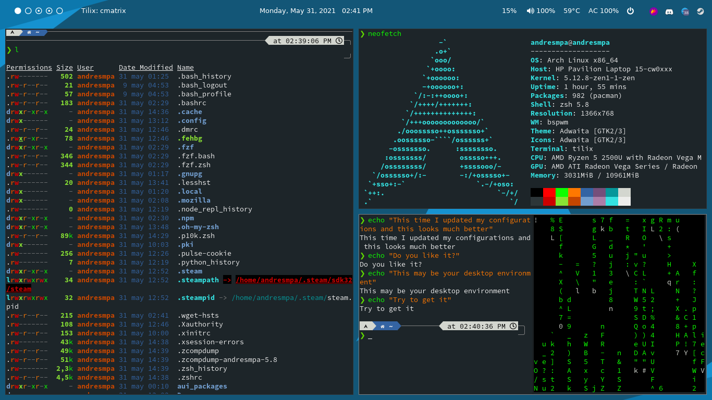

# Dotfiles

## Tips

My distro was built in Arch Linux using Linux zen kernel, if you have another kernel you can use this file but check my /autoscripts dir wich have some scripts I needed to make this thing works, also I have a "minimalistic" desktop so, if you want to move on it you have to use the keyboard, mine uses "ñ" so the layout is "latam" you may have to change it

---

## Summary

| Tecnology       | What I use |
| --------------- | ---------- |
| Kernel          | Linux zen  |
| Window Manager  | BSPWM      |
| Hotkey daemon   | sxhkd      |
| Status bars     | Polybar    |
| Window Composer | Compton    |
| Terminal        | Tilix      |
| Shell           | zsh 5.8    |
| Session Manager | LightDM    |
| LightDM Theme   | Glorious   |

## How the desktop Looks like

