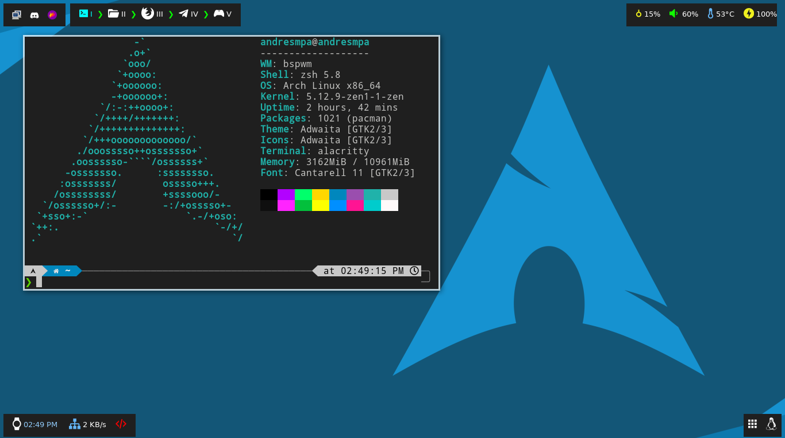
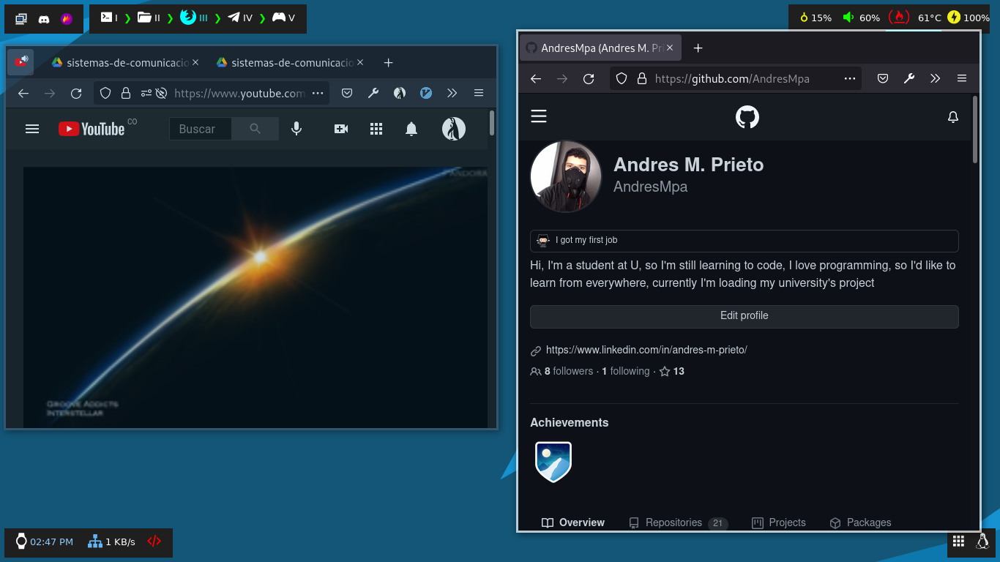
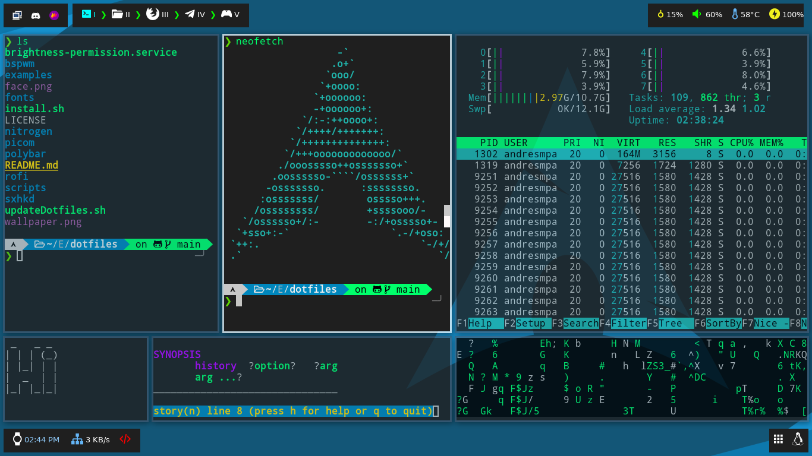

# Dotfiles

## Tips

My distro was built in Arch Linux using Linux zen kernel, if you have another kernel you can use these files, but check my ./.config/bspwmrc file wich have some scripts at the bottom you may not need to make yours work, also I have a "minimalistic" desktop so, if you want to move on it you have to use the keyboard, mine uses "ñ" so the layout is "latam" you may have to change it at bspwmrc file

Note: I'm switch from Tilix to Alacritty I found it faster, I implemented picom and I'm loading a new color schema, if you are using tilix you can check previous versions of this repository, you may find something useful

## To do:

- Switch to another WM or something

---

## Summary

| Tecnology       | What I use                                                                                                        |
| --------------- | ----------------------------------------------------------------------------------------------------------------- |
| Kernel          | [Linux zen](https://salmorejogeek.com/2020/09/23/linux-linux-lts-linux-zen-tres-kernels-oficiales-de-arch-linux/) |
| Window Manager  | [BSPWM](https://github.com/baskerville/bspwm)                                                                     |
| Hotkey daemon   | [sxhkd](https://github.com/baskerville/sxhkd)                                                                     |
| Status bars     | [Polybar](https://github.com/polybar/polybar)                                                                     |
| Window Composer | [Picom](https://wiki.archlinux.org/title/Picom)                                                                   |
| Terminal        | [Alacritty](https://github.com/alacritty/alacritty/wiki)                                                          |
| Shell           | [zsh 5.8](https://ohmyz.sh/)                                                                                      |
| Launcher        | [Rofi](https://wiki.archlinux.org/title/Rofi)                                                                     |
| Session Manager | [LightDM](https://wiki.archlinux.org/title/LightDM)                                                               |
| LightDM Theme   | [lightdm-webkit-theme-osmos](https://github.com/Exauthor/lightdm-webkit-theme-osmos)                              |

## Tools

| Utility                                                                     | Tool                                                      |
| --------------------------------------------------------------------------- | --------------------------------------------------------- |
| Search documentation and working without internet conection (Documentation) | [zeal](https://zealdocs.org/)                             |
| Text editor on the terminal the fastest way to make this                    | [neovim](https://andresmpa.github.io/nvim-configuration/) |
| Play video (mp4, gif, etc)                                                  | [vlc](https://www.videolan.org/vlc/index.es.html)         |
| Play video games and run some other tools                                   | [steam](https://store.steampowered.com/?l=spanish)        |
| Check backend development req, res, err                                     | [postman](https://www.postman.com/)                       |

## How the desktop Looks like

### Last update

## Installation

If you want to do it yourself source "install.sh", if
you also want the same configuration I'm using, source
"use.sh"

`$ git clone https://github.com/AndresMpa/dotfiles.git`

`$ cd dotfiles`

`$ source ./install.sh`
