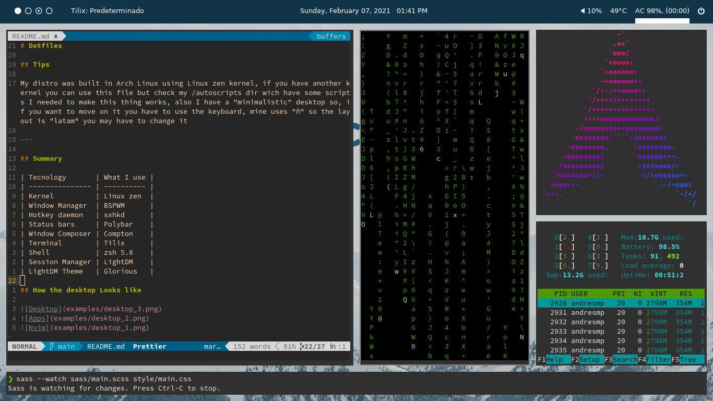
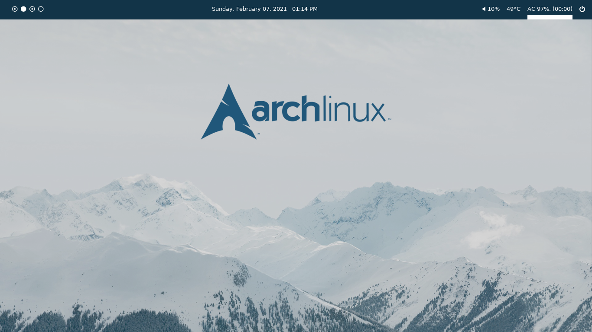
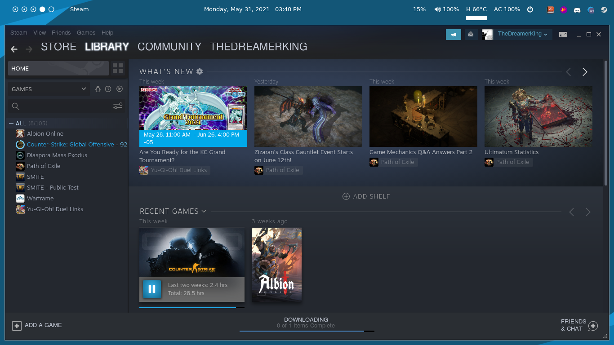
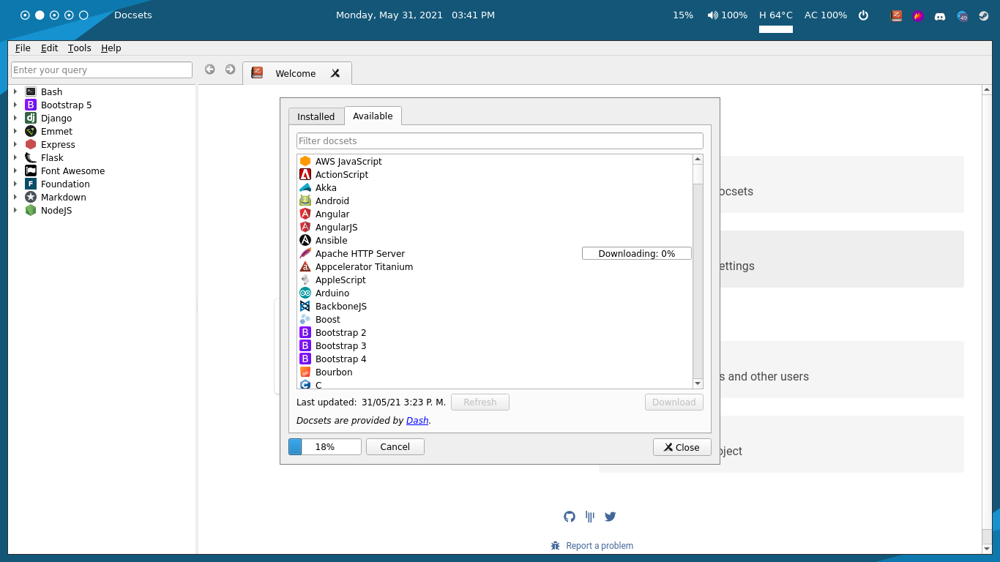

# Dotfiles

## Tips

My distro was built in Arch Linux using Linux zen kernel, if you have another kernel you can use this file but check my /autoscripts dir wich have some scripts I needed to make this thing works, also I have a "minimalistic" desktop so, if you want to move on it you have to use the keyboard, mine uses "ñ" so the layout is "latam" you may have to change it

---

## Summary

| Tecnology       | What I use                                                                                                        |
| --------------- | ----------------------------------------------------------------------------------------------------------------- |
| Kernel          | [Linux zen](https://salmorejogeek.com/2020/09/23/linux-linux-lts-linux-zen-tres-kernels-oficiales-de-arch-linux/) |
| Window Manager  | [BSPWM](https://github.com/baskerville/bspwm)                                                                     |
| Hotkey daemon   | [sxhkd](https://github.com/baskerville/sxhkd)                                                                     |
| Status bars     | [Polybar](https://github.com/polybar/polybar)                                                                     |
| Window Composer | [Compton](https://denovatoanovato.net/compton-instalacion-y-configuracion/)                                       |
| Terminal        | [Tilix](https://gnunn1.github.io/tilix-web/)                                                                      |
| Shell           | [zsh 5.8](https://ohmyz.sh/)                                                                                      |
| Session Manager | [LightDM](https://wiki.archlinux.org/title/LightDM)                                                               |
| LightDM Theme   | [lightdm-webkit-theme-osmos](https://github.com/Exauthor/lightdm-webkit-theme-osmos)                              |

## Tools

| Utility                                                                     | Tool                                                      |
| --------------------------------------------------------------------------- | --------------------------------------------------------- |
| Search documentation and working without internet conection (Documentation) | [zeal](https://zealdocs.org/)                             |
| Text editor on the terminal the fastest way to make this                    | [neovim](https://andresmpa.github.io/nvim-configuration/) |
| Play video (mp4, gif, etc)                                                  | [vlc](https://www.videolan.org/vlc/index.es.html)         |
| Play video games and run some other tools                                   | [steam](https://store.steampowered.com/?l=spanish)        |
| Check backend development req, res, err                                     | [postman](https://www.postman.com/)                       |

## How the desktop Looks like

###My terminal and shell

###BSPWM examples

###Resizing windows

###We can also play

###Zeal for developer

