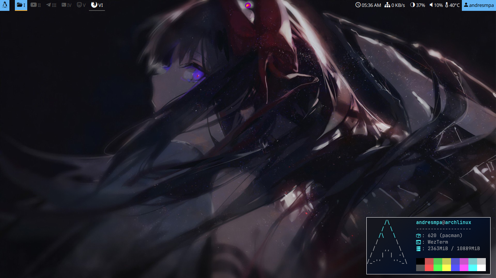

# Dotfiles

"Dotfiles" are configuration files, scripts and documentation about an operative system; this repositorie
contains my configuration files including scripts, my shell config, some setting for those tools that I
use; also some recomendations and guides such as "Corne" which contain all the necessary materials for
building your own Corne keyboard such as mine. I high recommend to check some of my daemons if you use
systemctl and AMD GPU like Radeon or something like that

## To do

- [x] Try i3
- [x] Try Awesome (I hate it with all the stretch of my heart, which is sad since I love Lua)
- [x] Try Hyprland (I did not like it), waiting for a more complete "ecosystem"
- [x] Go back to BSPWM
- [x] Look for something else
- [x] Fix and complete install scripts

  - [x] Test BSPWM minimal
  - [x] Test BSPWM custom config
  - [x] Complete BSPWM minimal
  - [x] Complete Qtile minimal
  - [x] Complete Sway minimal
  - [x] Complete BSPWM custom config
  - [x] Complete Qtile custom config
  - [x] Complete Sway custom config
  - [ ] Fix sxhkdrc script

---

## Desktop environments

<h3><a href="./documentati/BSPWM.md">BSPWM</a></h3>


<h3><a href="./documentati/Qtile.md">Qtile</a></h3>


[Change theme feature](https://youtu.be/i6-JxMmvesE)

<h3><a href="./documentation/Windows.md">Windows</a></h3>


<h3><a href="./documentati/Sway.md">Sway</a></h3>


<h3><a href="./documentati/BSPWM.md">BSPWM track #2</a></h3>




<h3><a href="./documentati/BSPWM.md">i3 - Vimium like</a></h3>


## Installation

If you want to do it yourself source `$install.sh <desktop>`, them choose "y" if
you want the same configuration, type "n" if you want it from scratch.

NOTE: If you see error please add and issue, I'll try yo solve it ^-^

```
$ git clone https://github.com/AndresMpa/dotfiles.git
$ cd dotfiles
$ source ./install.sh
```

If you are using AMD GPU, try "postInstall", it could help you; also if you want
to change your shell source "postInstall" too
```
$ source ./install.sh
```

## Keyboard configuration


[Corne](./documentation/Keymap.md)

### Installation & configuration of QMK

```
sudo pacman --needed --noconfirm -S git python-pip libffi
sudo pacman -Syyu qmk
qmk setup
qmk config user.keyboard=crkbd/rev1
qmk config user.keymap=AndresMpa
qmk new-keymap
qmk compile -kb crkbd -km AndresMpa
```

### Util

[SafeEyes](https://github.com/slgobinath/SafeEyes)
I use glasses so I don't want to use bigger ones, it helps me to rest

[Redshift](https://wiki.archlinux.org/title/redshift)
This util change the color or my screen for me, it makes easier to use
the computer
