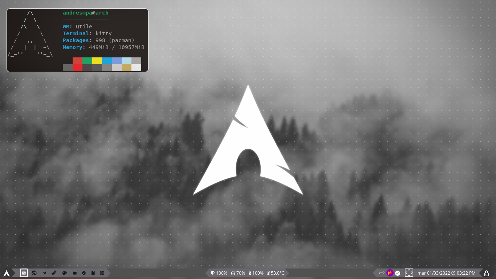
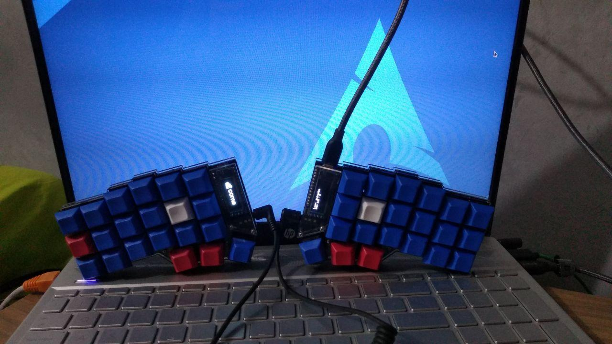

# Dotfiles

"Dotfiles" are configuration files, scripts and documentation about an operative system; this repositorie
contains my configuration files including scripts, my shell config, some setting for those tools that I
use; also some recomendations and guides such as "Corne" which contain all the necessary materials for
building your own Corne keyboard such as mine. I high recommend to check some of my daemons if you use
systemctl and AMD GPU like Radeon or something like that

## To do

- [ ] Try i3
- [ ] Try Awesome
- [ ] Go back to BSPWM
- [ ] Look for something else

---

## Last created feature

[Change theme feature](https://youtu.be/i6-JxMmvesE)

## Time programming this week

[](https://wakatime.com/badge/github/AndresMpa/dotfiles)

## Check my work


[BSPWM](./documentation/BSPWM.md)




[Qtile](./documentation/Qtile.md)


[Windows](./documentation/Windows.md)

## Installation

If you want to do it yourself source "install.sh", if
you also want the same configuration I'm using, source
"use.sh"

```
$ git clone https://github.com/AndresMpa/dotfiles.git
$ cd dotfiles
$ source ./install.sh
```

## Keyboard configuration




[Corne](./documentation/Keymap.md)

### Installation & configuration of QMK

```
sudo pacman --needed --noconfirm -S git python-pip libffi
sudo pacman -Syyu qmk
qmk setup
qmk config user.keyboard=crkbd/rev1
qmk config user.keymap=AndresMpa
qmk new-keymap
qmk compile -kb crkbd -km AndresMpa
```

### Util

[SafeEyes](https://github.com/slgobinath/SafeEyes)
I use glasses so I don't want to use bigger ones, it helps me to rest

[Redshift](https://wiki.archlinux.org/title/redshift)
This util change the color or my screen for me, it makes easier to use
the computer
