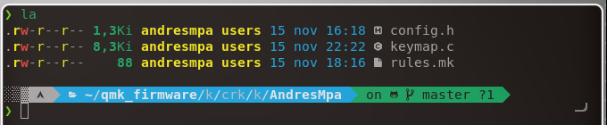

This fancy keymap was made to work under latam distribution the keyboard that
I'm using is a corne keyboard, I'm shearing pieces to build it your own

## Pieces and links

- [keycaps/blue](https://www.amazon.com/dp/B07SHL4DMZ?psc=1&ref=ppx_yo2_dt_b_product_details) x 4
- [keycaps/white](https://www.amazon.com/Profile-Keyset-gruesas-teclado-mec%C3%A1nico/dp/B08YR6KNX9/ref=pd_rhf_ee_s_rp_c_2_2/131-5869225-5262935?pd_rd_w=TFlxK&pf_rd_p=ea4c61f8-82f0-45ed-80f2-188a75a3e925&pf_rd_r=8N8E9EBFEXCVQ93M4H5A&pd_rd_r=b3ee0173-9925-4dd5-b0ec-08bc11ea6b45&pd_rd_wg=A2lJo&pd_rd_i=B08YR6KNX9&psc=1) x 1
- [Keyswitch](https://www.amazon.com/gp/product/B0121JH9XI/ref=ppx_yo_dt_b_asin_title_o07_s00?ie=UTF8&th=1) x 5
- [Keyboard to keyboard cable](https://www.amazon.com/est%C3%A9reo-espiral-Haokiang-grados-extensi%C3%B3n/dp/B07FFW8YZR/ref=pd_rhf_ee_s_rp_c_2_7/131-5869225-5262935?pd_rd_w=TFlxK&pf_rd_p=ea4c61f8-82f0-45ed-80f2-188a75a3e925&pf_rd_r=8N8E9EBFEXCVQ93M4H5A&pd_rd_r=b3ee0173-9925-4dd5-b0ec-08bc11ea6b45&pd_rd_wg=A2lJo&pd_rd_i=B07FFW8YZR&psc=1) x 1
- [C port to USB port](https://www.amazon.com/Powerline-durabilidad-dispositivos-incluyendo-Chromebook/dp/B01M3NB6FB/ref=pd_rhf_ee_s_rp_c_2_6/131-5869225-5262935?pd_rd_w=TFlxK&pf_rd_p=ea4c61f8-82f0-45ed-80f2-188a75a3e925&pf_rd_r=8N8E9EBFEXCVQ93M4H5A&pd_rd_r=b3ee0173-9925-4dd5-b0ec-08bc11ea6b45&pd_rd_wg=A2lJo&pd_rd_i=B01M3NB6FB&th=1) x 1
- [Corne MX Hotswap v3.0.1 PCB Kit](https://www.littlekeyboards.com/collections/corne-pcb-kits/products/corne-mx-hotswap-pcb-kit-v3?variant=32252819308611) x 1
- [Corne Technician Keyboard Case - Clear (Scratch Resistant)](https://www.littlekeyboards.com/products/corne-technician-keyboard-case)
- [Elite-C v4](https://www.littlekeyboards.com/products/elite-c-v3) x 2
- [128X32 OLED Screen](https://www.littlekeyboards.com/products/oled-screen) x 2 (Optional)

If you buy the keyboard this way, you will need to a welder to weld some pieces
of the keyboard, [I used this one](https://www.amazon.com/gp/product/B087767KNW/ref=ppx_yo_dt_b_asin_title_o06_s00?ie=UTF8&psc=1)
you might also need a [desolder](https://www.amazon.com/gp/product/B08Y71S2Q6/ref=ppx_yo_dt_b_asin_title_o01_s01?ie=UTF8&psc=1)
after getting all those things you can build your own keyboard, but you still
need some software to make it works, there's where this keymap helps, it works
under latam but I also have an english distribution, but focus on the software
[QMK](https://beta.docs.qmk.fm/tutorial) is the tool that generally we use for
this purpose.

---

### Quick QMK tutorial

I use arch, so I need to use pacman, check the [list](https://beta.docs.qmk.fm/tutorial/newbs_getting_started#linux-wsl)
if you have other package manager

```
sudo pacman --needed --noconfirm -S git python-pip libffi
python3 -m pip install --user qmk
```

Once we have QMK we can use the command line

```
# First set up
qmk setup

# Test the if everything is okay
qmk compile -kb crkbd -km default
```

Well, if everything is working, we can use an easier way
to manage our keymap, just use this instruction

```
# crkbd for Corne keyboard
qmk config user.keyboard=crkd/rev1
# $USER is you OS user, you can also use your github user
qmk config user.keymap=$USER
# Check if it is working
qmk compile
```

Now, we can edit a personal distribution for our keymap,
enter this dir

```
# Replace $USER if you used another name before
cd qmk_firmware/keyboards/crkbd/keymaps/$USER
ls
```

You should see something like this:



---

#### Important

config.h file is same as default config,
if you want a custom behavior, you will have to edit it,
same for keymap.c and rules.mk.

rules.mk control OLED Screen and some other this, if
you don't have it set OLED_ENABLE = no

Edit config.h and set #define EE_HANDS to uncommented, this
makes that the keyboard assign by itself a master for each hand
if you plug in left first, left hand will be the "master" or
"main" same on right hand

---

## Getting this keymap

This is really easy, just copy and paste what is inside the
dir [AndresMpa](../AndresMpa) on its respective file, then

```
qmk compile

qmk flash -kb crkbd -km $USER -bl dfu-split-left
qmk flash -kb crkbd -km $USER -bl dfu-split-right
```

That's it, if you want to set your environment as mine I can
also recommend you to use [nvim](https://github.com/AndresMpa/nvim-configuration), if you are building this, surely you're as
crazy as I so, jump in; I guess it can like you
